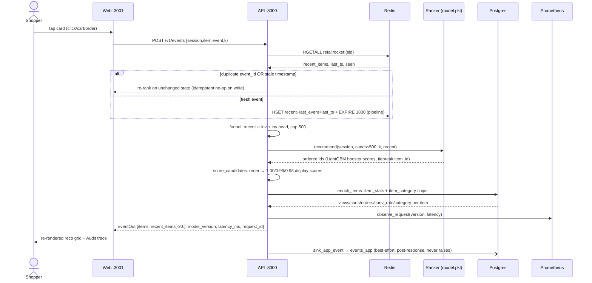
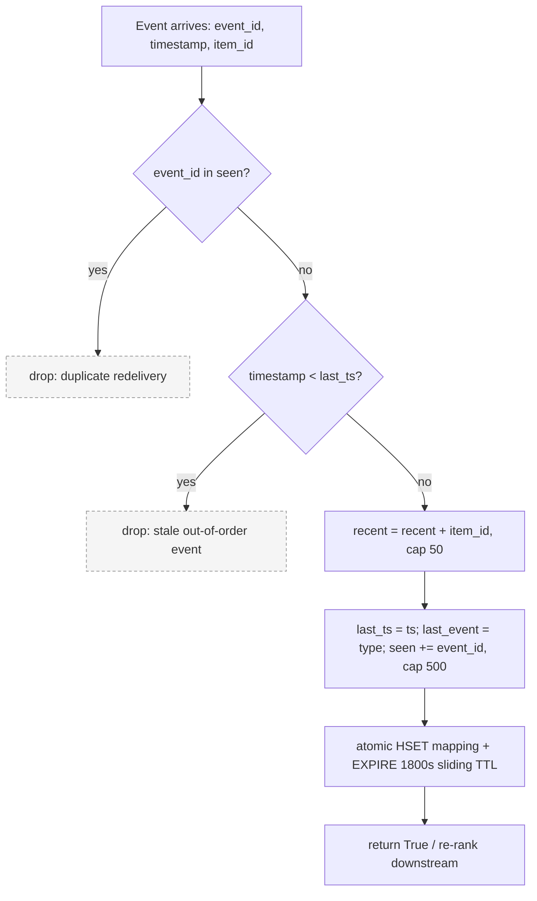
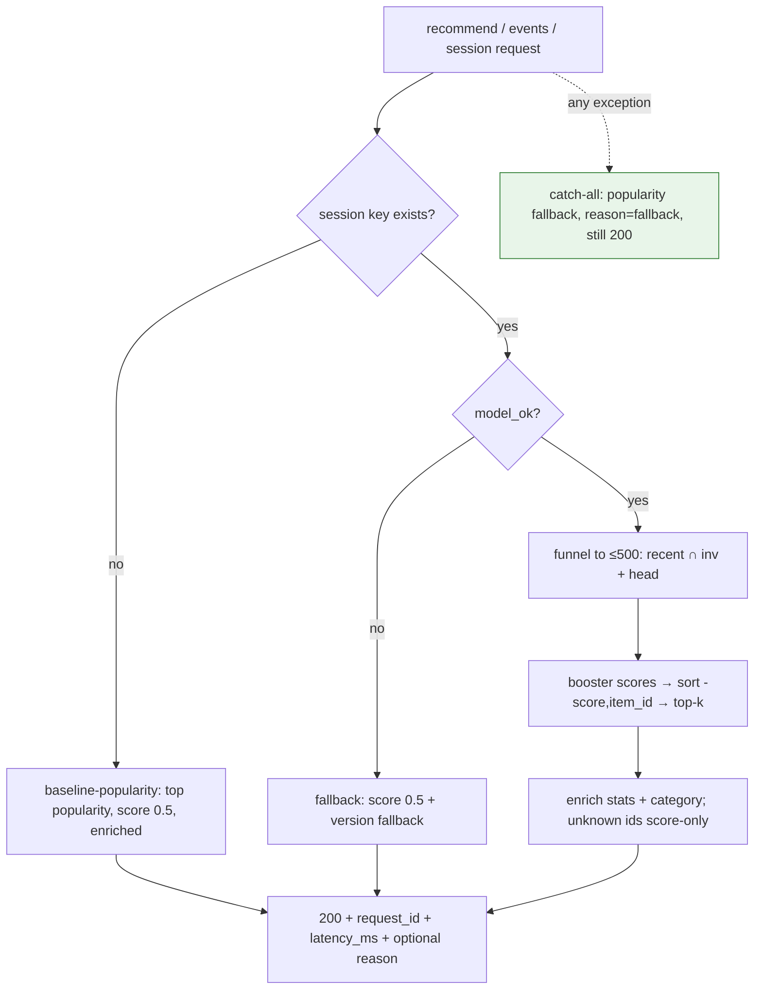
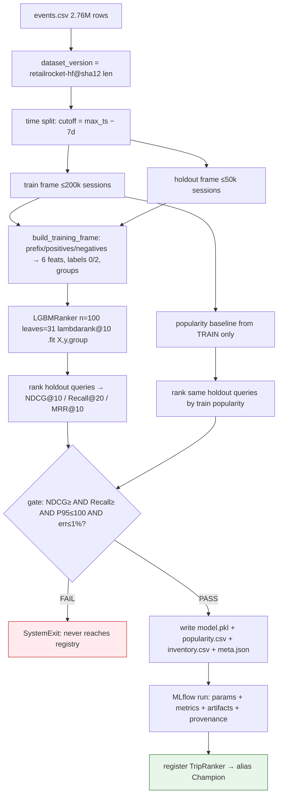
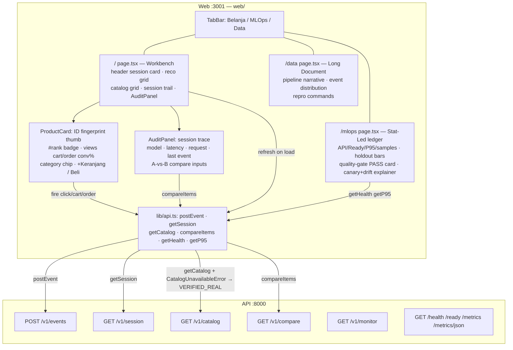
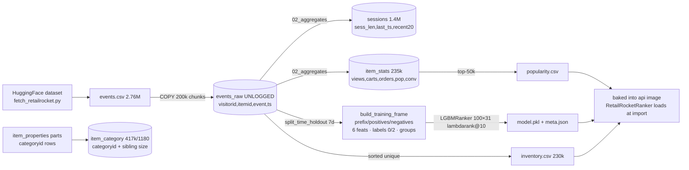
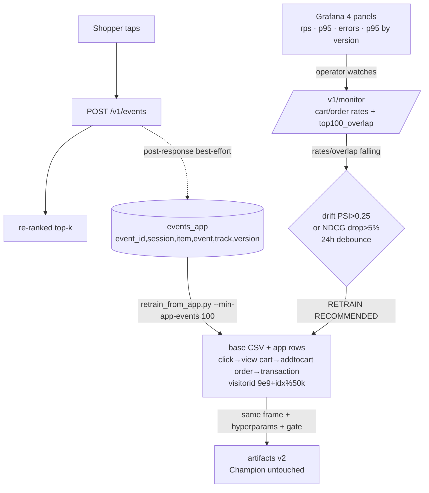

# TripRank Architecture Elaborated

> Diagrams + flows + use cases, derived from the shipped code at `7443be2`.
> Companion to `docs/architecture.md` (service catalog), `docs/api-reference.md`
> (endpoint contracts), `docs/mlops.md` (canary/retrain ops), `docs/web-frontend.md`
> (pages/components). §8 covers the web application in the same detail.
> Diagram notation: Mermaid. Render at https://mermaid.live or any
> Mermaid-enabled viewer. Every actor, message, and branch below traces to a
> file + line range cited inline — no invented steps.

## 0. Actor & system map

| Actor | Description | Touches |
|---|---|---|
| Shopper | Human tapping product cards in the web shop | `web/app/page.tsx` only |
| ML Engineer | Retrains, promotes, rolls back models | `scripts/*`, MLflow `:5000`, registry |
| Operator | Starts/stops stack, watches Grafana, pages on alerts | compose, `:3000`, `:9090` |
| Web (Next.js) | Shop + audit + mlops + data pages, browser-side fetches | `:3001` → API `:8000` |
| API (FastAPI) | Recommend / events / session / catalog / compare / monitor / health / ready / metrics | `api/main.py::create_app` |
| Streaming svc | Kafka `triprank-events` → `SessionProcessor` → Redis | `src/streaming/consumer.py`, `session_processor.py` |
| Redis | Live session hashes, 30-min sliding TTL | key `{track}:{session_id}` |
| Postgres | `events_raw`, `sessions`, `item_stats`, `item_category`, `events_app` | `sql/*.sql` |
| Kafka | Event bus topic `triprank-events` | dual listeners `:29092`/`:9092` |
| MLflow | Tracking runs + `TripRanker` registry (Champion/Challenger) | `:5000` |
| Prometheus/Grafana | Scrape `api:8000` every 15s; 4-panel dashboard, 10s refresh | `:9090` / `:3000` |

## 1. Use-case diagram

```mermaid
flowchart LR
    Shopper((Shopper))
    MLEngineer((ML Engineer))
    Operator((Operator))

    Shopper --> UC1[Browse catalog]
    Shopper --> UC2[Click / cart / order item]
    Shopper --> UC3[Compare A vs B]
    UC1 -.-> UC2
    UC2 --> UC4[Receive re-ranked top-K]

    MLEngineer --> UC5[Retrain from base CSV]
    MLEngineer --> UC6[Retrain from live traffic]
    MLEngineer --> UC7[Promote / rollback Champion]
    UC5 --> UC8[Quality gate PASS/FAIL]
    UC6 --> UC8

    Operator --> UC9[Start / stop stack]
    Operator --> UC10[Watch Grafana + /v1/monitor]
    Operator --> UC11[Advance / rollback canary]
    UC10 --> UC6
    UC10 --> UC11
```



Use-case notes (grounded):

- **UC1** reads `GET /v1/catalog?n=12` (`api/main.py:558`); falls back to the
  `VERIFIED_REAL` ID list when the endpoint is unavailable (`web/lib/api.ts`,
  `CatalogUnavailableError`).
- **UC2** posts `POST /v1/events` (`web/lib/api.ts::postEvent`); one round
  trip applies the event, re-ranks, and best-effort sinks to `events_app`
  (`api/main.py:411-455`).
- **UC3** calls `GET /v1/compare?a=&b=` (`api/main.py:572`); unknown ids
  return `{"known": false}` — surfaced by `AuditPanel` as the dashed
  "tak dikenal" card.
- **UC5** runs `python -m src.training.train_real` (`src/training/train_real.py:75`);
  **UC6** runs `python scripts/retrain_from_app.py` (gate at `--min-app-events 100`).
- **UC8** is `src/evaluation/quality_gate.py::evaluate_gate`: challenger NDCG/Recall
  ≥ champion, P95 ≤ 100ms, error ≤ 1%; FAIL raises `SystemExit` in `train_real.py:123`.
- **UC11** evaluates `src/deployment/canary.py::evaluate_step` over the
  `95/5 → 75/25 → 50/50 → 0/100` ladder with 500-request windows; rollback to
  `100/0` on 5xx > 2% or P95 > 200ms.

## 2. Serving sequence — `POST /v1/events` (the hot path)

One shopper tap drives this exact call chain
(`api/main.py:411-455`, `src/models/inference.py:10-28`):



Key contracts visible in the diagram:

- Display scores (`1.00, 0.99, …`) are `1.0 − idx*0.01` from rank position
  (`inference.py:21`) — cosmetic, not booster outputs.
- `recent_items` is appended then trimmed to the last 50 in the API path
  (`api/main.py:431`) and the response carries the last 20 (`:443`);
  the streaming path caps at 50 independently (`session_processor.py:52`).
- The sink runs **after** the response object is built (`:443-449`); even a
  monkeypatched `sink_app_event` failure cannot touch the response.

## 3. Session-state flowchart (write path)

Timestamp authority + idempotency, shared by the API ingest path
(`api/main.py:429-435`) and the streaming consumer
(`session_processor.py:38-66`):



Bounds (verified constants): recent cap 50 (both writers), `seen` cap 500
(`session_processor.py:55`; API path at `api/main.py:251-260` keeps
`recent[-50:]` + `sorted(seen)[-500:]`), TTL 1800s
(`session_processor.py:8`), sliding on every accepted event.

## 4. Cold / warm / degraded serving flowchart



Only `/ready` may return 503 (Redis or model not ready, `api/main.py:552-556`).
`/health` is dependency-free (`:548-550`).

## 5. Training pipeline flowchart

`src/training/train_real.py:75-162`:



Provenance on every run (`src/training/train.py:21-30`): `dataset_version`,
`git_commit` + dirty flag, `run_id`. Retrain-from-traffic
(`scripts/retrain_from_app.py`) reuses `split_time_holdout`, `rank_queries`,
`build_training_frame`, and `evaluate_gate` with identical hyperparams,
mapping `events_app` rows back (`click→view, cart→addtocart, order→transaction`)
under synthetic `visitorid = 9e9 + idx % 50k`, and writes `v2` artifacts
**without touching Champion**.

## 6. Monitoring & drift loop

```mermaid
flowchart LR
    subgraph serve [Serving]
        A[API done closuresevery request]
    end
    subgraph fast [Seconds]
        B[deque 1000 latencies<br/>/metrics/json]
        C[/v1/monitor/<br/>events_app counts<br/>cart/order rates<br/>top100_overlap]
    end
    subgraph slow [15s – 10s refresh]
        D[Prometheus scrape api:8000]
        E[Grafana 4 panels<br/>rps · p95 · errors · p95 by version]
    end
    subgraph decide [Offline triggers]
        F[drift.py: PSI bands<br/>0.10 / 0.25]
        G[drift.py: NDCG drop > 5%]
        H[RETRAIN RECOMMENDED<br/>24h debounce]
    end

    A --> B
    A -->|observe_request per version| D
    D --> E
    C -->|overlap falling| F
    C -->|rates falling| G
    F --> H
    G --> H
    H -->|operator runs| I[retrain_from_app.py]
```

Metric names (`src/monitoring/metrics.py:10-15`):
`triprank_requests_total{model_version}`,
`triprank_errors_total{model_version}`,
`triprank_latency_seconds{model_version}`. Grafana queries in
`monitoring/grafana/dashboards/triprank.json:17-63`.

## 7. Deployment & rollback map

| Action | Command / call | Verified source |
|---|---|---|
| Full stack up | `docker compose up -d --build` (9 services) | `docker-compose.yml`, `docs/runbook.md` |
| Health / readiness | `GET :8000/health` → ok; `GET :8000/ready` → ready/503 | `api/main.py:548-556` |
| Deploy new version | register → move `Champion` alias → rebuild `api` (bundle baked) | `registry.py:26-28`, `docs/mlops.md` §5 |
| Rollback model | re-point `Champion` to prior version + rebuild `api` | `docs/runbook.md` §5 |
| Rollback deploy | `docker compose up -d <service>` with previous image (tag first — compose has no versioning) | `docs/runbook.md` §5 |
| Canary advance | `evaluate_step`: err ≤ 1% + p95 ≤ 100ms over 500 req → next rung | `canary.py:18-24` |
| Canary rollback | err > 2% or p95 > 200ms → `100/0` | `canary.py:14-17` |
| Registry outage | `promote()` returns BLOCKED + queues JSON to `/tmp/triprank-queue` | `registry.py:31-39` |

UNVERIFIED: end-to-end canary with live split traffic (ladder logic is
implemented + tested; the API serves a single ranker — verify by wiring the
split before claiming canary deploys). UNVERIFIED: automated retrain cadence
(no scheduler wired — run manually or add cron/CI).

## 8. Application elaboration (web + serving + data in one view)

### 8.1 Web application — pages, components, API calls

Three routes, one shared `TabBar`, one shared `web/lib/api.ts` client
(`API_BASE` from `NEXT_PUBLIC_API_BASE`, baked at build):



Grounded details:

- Shop state machine (`web/app/page.tsx:47-130`): `sid` (localStorage
  `triprank:sid`, `shop-xxxxxx` when absent) → `refresh(id)` = `getSession`
  → reco/trail/meta; `fire(itemId, type)` = `postEvent` → replace reco +
  trail + meta. `pending` disables all card buttons during flight; failures
  set an inline banner, never a blank page.
- Catalog source (`page.tsx:77-106`): `getCatalog(12)` maps only numeric
  fields that are actually numbers; any throw → `VERIFIED_REAL` (real
  popularity IDs 187946/461686/5411/370653/219512 + real-looking tail) with
  `catalogLive=false` ("populer" badge instead of "live").
- MLOps numbers (`mlops/page.tsx:11-15`): hard-coded holdout table
  (NDCG 0.9777/0.7274, Recall 0.9947/0.9656, MRR 0.9727/0.6429 — matches
  `meta.json` production metrics) + live API/Ready/P95/samples via
  `getHealth`+`getP95` (`:35-50`).
- `ProductCard` contract (`ProductCard.tsx:31-51`): hue fingerprint
  `HUES[h % 5]` over `(h*31 + code) % 997`; `rank = popularityRank ?? rank`;
  stats/cart-order/conv/score cells render only when numeric; honesty caption
  "Tanpa nama — dataset hanya menyimpan ID. Angka di atas statistik asli."
- `AuditPanel` contract (`AuditPanel.tsx:59-172`): trace grid mirrors
  `EventOut` fields; compare defaults A=`187946` B=`461686`; unknown side →
  dashed "tak dikenal (di luar katalog latih)" card; compare errors inline.

### 8.2 Serving data flow — Redis, Postgres, ranker in one sequence

Extends §2's event sequence with the storage reads that were elided there
(`api/main.py:42-120`, `223-278`):

```mermaid
sequenceDiagram
    participant W as Web :3001
    participant A as API create_app
    participant R as Redis {track}:{sid}
    participant B as RetailRocketRanker
    participant P as Postgres

    W->>A: POST /v1/events (session,item,type,k)
    A->>R: HGETALL key → recent_items last_ts last_event seen
    alt cold (key missing)
        A->>B: popularity(k) — true popularity order, not inventory order
        A->>P: enrich_items (lazy-load item_stats + item_category once)
        A-->>W: baseline-popularity · score 0.5 · 200
    else warm
        A->>R: HSET recent[-50:] last_ts last_event seen[-500:] + EXPIRE 1800
        A->>B: recommend(session, funnel≤500, k, recent)
        Note over B: _features: recency/repeat from prefix;<br/>pop/conv proxy from popularity.csv rank;<br/>booster.predict → sort -score,item_id
        A->>P: enrich_items: views/carts/orders/conv_rate + category chips
        A-->>W: ranker-retailrocket-v1 · rank scores · 200
    end
    A-)P: sink_app_event → events_app (post-response, best-effort)
```

Funnel rule (`api/main.py:395-409` + `436-442`): `inv[:k]` when no history,
else full inventory trimmed to `recent ∩ inv + head`, cap 500. Persistence
bounds: `recent[-50:]`, `sorted(seen)[-500:]` (`:251-263`), TTL 1800s.
`enrich_items` is additive-only — unknown ids keep score, uncategorized items
carry no chip (`:97-120`).

### 8.3 Training data flow — CSV → Postgres → frame → artifacts



Grounded: `events_raw` starts UNLOGGED, `SET LOGGED` after aggregates
(`02_aggregates.sql:33`); `sessions.recent_items` cap 20 DESC
(`:7-13`); `item_conv_rate = (carts+orders)/views`
(`:27-31`); category is latest-timestamp-wins, standalone table so reloads
don't wipe it (`04_item_category.sql:1-7`); `inv` sorted ascending
(`train_real.py:133`) — hence the cold-start fix serving `popularity()`
instead of inventory order.

### 8.4 MLOps closed loop — traffic back to training



What's manual vs automatic today: event capture, monitoring, drift math, and
the retrain script are all implemented; the **trigger is human** — an
operator reads Grafana/`/v1/monitor` and runs `retrain_from_app.py`, then
promotes via the `Champion` alias. UNVERIFIED: any scheduler or auto-promote
wire-up — no cron/CI job exists; verify in the repo before claiming
automation.

### 8.5 Failure-mode matrix (application view)

| Failure | User sees | System does | Verify |
|---|---|---|---|
| Unknown session (cold) | popularity grid, no error | `baseline-popularity`, score 0.5, enriched | `api/main.py:386-391,479-481` |
| Ranker throws / missing | same grid shape, `fallback` version | `score_candidates` catch-all, never 5xx | `inference.py:24-28` |
| Postgres down | cards without stats/chips, monitor degraded | lazy caches stay `{}`, sink skipped, `reason` set | `api/main.py:63-64,92-93,542-545` |
| Redis down | app still responds (in-process store) | `_resolve_store` dict fallback, `/ready` 503 | `api/main.py:289-306,552-556` |
| Catalog endpoint fails | `VERIFIED_REAL` grid, "populer" badge | `CatalogUnavailableError` → fallback list | `api.ts:112-121`, `page.tsx:101-104` |
| Compare unknown id | dashed "tak dikenal" card | `{"known": false}` per side | `api/main.py:584-599`, `AuditPanel.tsx:18-27` |
| Malformed Kafka msg (no `timestamp`) | nothing (async path) | consumer `KeyError` — known gap, own producer so low risk | `architecture.md` §6 |
| MLflow down at train | train aborts before registry | `SystemExit` on gate FAIL; outage queue `/tmp/triprank-queue` | `train_real.py:122-123`, `registry.py:31-39` |
